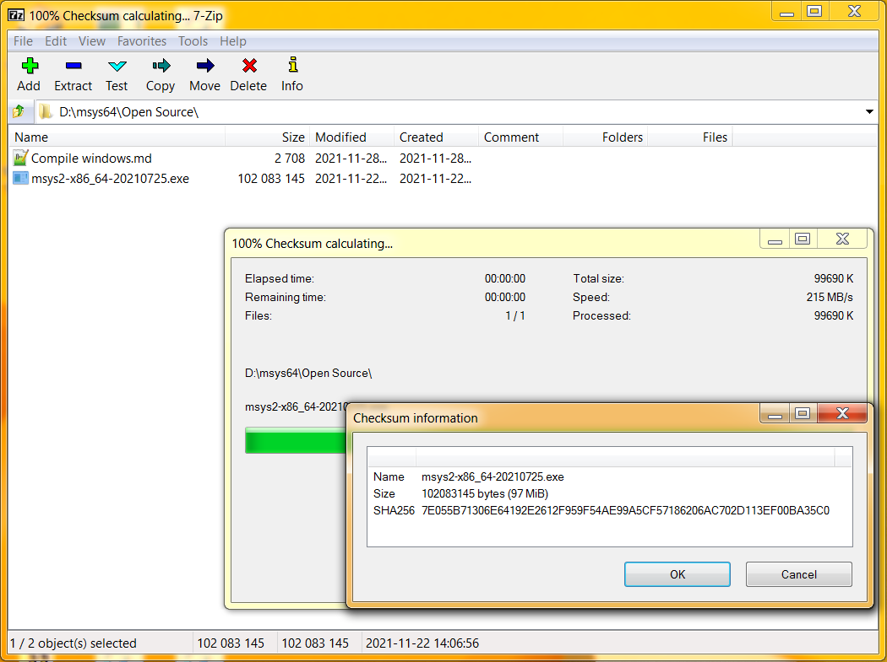
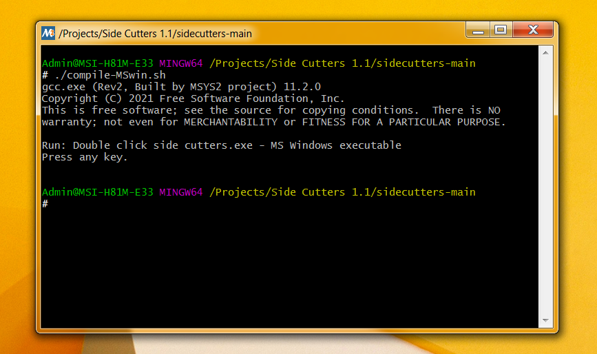

# Compile Side Cutters

How to compile on 64 bit Windows 7 or newer.

## Install MSYS

1. Download the installer: msys2-x86_64-20210725.exe https://github.com/msys2/msys2-installer/releases/download/2021-07-25/msys2-x86_64-20210725.exe Verify with SHA256 checksum 7e055b71306e64192e2612f959f54ae99a5cf57186206ac702d113ef00ba35c0. Use 7zip to verify the checksum.

2. Run the installer. MSYS2 requires 64 bit Windows 7 or newer.
3. Enter your desired Installation Folder (short ASCII-only path on a NTFS volume, no accents, no spaces, no symlinks, no subst or network drives, no FAT).
4. When done, tick [Run MSYS2] now.
5. Update the package database and base packages. Unless your setup file is very recent, it will take two steps. First run *pacman -Syu*
6. Run *MSYS2 MSYS* from Start menu. If this opens *msys2_shell.cmd* file in your text editor, you should save the *msys2_shell.cmd* to *msys2_shell.bat* file. Right-Click *MSYS2 MSYS* from Start menu, and *Properties* from the context menu. Change the shortcut's target from *.cmd* to *.bat*
7. Update the rest of the base packages with *pacman -Su* if *D:\msys64\usr\bin\gpg-agent.exe* conflicts with your anti-virus software, create an exception for it. Verify the file has SHA256 checksum c5019c0957394776e5d42bfd3db266e4aab1541f82e1ab3feefe323319e0e369.

## Install MinGW

1. Run "MSYS2 MSYS" from Start menu. *pacman -S --needed base-devel mingw-w64-x86_64-toolchain*
   To start building using the mingw-w64 GCC, close this window and run "MSYS MinGW 64-bit" from Start menu. Now you can call make or gcc to build software for Windows. Check out the introduction page https://www.msys2.org/wiki/MSYS2-introduction/ to learn which Start menu item to use when and which packages to install. Take look at Detailed MSYS2 install guide https://www.msys2.org/wiki/MSYS2-installation/ for troubleshooting and additional details on how to keep your MSYS2 up-to-date.

## Append MinGW to the path

1.  Hit the [windows start button], right click [Computer]. Select [Computer Properties] from the context menu. On the Left-hand side of the new windows, 
hit [Advanced system properties]. This opens the Advanced tab of system properties.
2.  Click [Environment Variables...]  Scroll down System variables (not user variables) to: [path]. Select the path and hit [Edit..]. 
Append ;D:\msys64\mingw64\bin to the path and click [Ok] three times. 
3.  Hit the [windows start button], Mouse over the [right arrow icon] right from [Shut down] till the tooltip pops up. Logoff and Logon again. 

## Install GTK

1. Run "MSYS2 64bit -> MSYS2 MSYS" from Start menu. *pacman -S mingw-w64-x86_64-gtk3* 

## Compile and run tests

1.  Run "MSYS2 64bit -> MSYS2 MinGW 64-bit" from Start menu. 
2.  Download the zipped code from https://github.com/Geert-Jan77/sidecutters green *code* button, https://github.com/Geert-Jan77/sidecutters/archive/refs/heads/main.zip and unzip. Find the 'sidecutters-main' folder. The msys shell listens to both ls (Bash command) and dir (DOS command)
3.  Run the command <code>./compile-MSwin.sh</code>

4.  Run the command <code>./'side cutters.exe'</code> This will also work as <code>"side cutters.exe"</code> on a Command Prompt.
 
